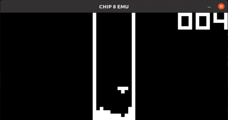

# CHIP8 emulator
Author: Richard Shmel  
personal project CHIP8 emulator written in C++  
built and tested on **Ubuntu 20.04**  
##### TODO
add SDL2 functions to handle interfacing with the sound timer register and outputting sound  

##### BUGS  
When the program starts, it will occasionally crash and display the following message:  
*X Error of failed request:  BadWindow (invalid Window parameter)*  
this seems to be an issue with how SDL2 interacts with XWindow; I have not found the root cause of the bug yet since it can be fixed by just retrying the command

# Overview
CHIP8 is a simple, 8-bit, assembly language used for simple game development and still has a small following of dedicated developers to this day. CHIP-8 programs are strictly hexadecimal based. Each CHIP-8 instruction is two bytes in length and is represented using hexadecimal digits. CHIP-8 instructions are stored directly in system memory. Originally, all CHIP-8 code would be entered directly into the system using a disk or memory editing utility. Modern platforms allow files containing the binary data of a CHIP-8 program to be loaded into an emulater designed to replicate the assembly language instructions. By modern standards, CHIP8 is very simple, consiting of:  

4 kilobytes of RAM  
64 x 32 monochrome pixel display for output  
A hexidecimal keypad (0x0 through 0xF) for user input  
CPU registers like a program counter, memory index, and stack pointers  
A stack for 16-bit addresses, which is used to call and return from subroutines  
A delay timer and sound timer, decremented at a rate of 60 Hz, used for timing and sound functions  
16 general-purpose registers (0x0 through 0xF)   

This CHIP8 emulator runs CHIP8 programs (typically a ".ch8" file). The main chip8.cpp program will spin off multiple threads to handle the timers, the CPU, and user IO. The program eumulates the CPU in a fetch-decode-execute cycle, pulling OPCODES from RAM and executing them. Output is displayed via a black and white display using the SDL2 library. User input is provided by simulating a hex keyboard with the number keys 0-9 and the letters A-F.  

#### Resources
Cowguide's Chip-8 technical reference  
http://devernay.free.fr/hacks/chip8/C8TECH10.HTM  

CHIP8 wikipedia page  
https://en.wikipedia.org/wiki/CHIP-8  

# Usage
run the emulator by running the chip8 binary (./chip8 from the emulator directory):  
**-h** displays the help text.  
**-f** chip8 file that should be loaded into memory.  
**-s** simulation clock speed (0, 1, or 2). 0 is the slowest speed while 2 is the fastest. This setting manipulates the "internal clock" that the CPU uses (which is really just a delay per instruction). Default value is 1.  
**-x** pixel scale value. On modern displays, rendering a 64x32 pixel-wide display would be unusable. Instead, the program scales the pixels by a scaling factor. recomended values are either 10 or 20.  
**-k** use the custom tetris keybinding. This makes the game actually playable by mapping the "hex keyboard" to the arrow keys and the spacebar. Use left and right arrows to move the piece, the spacebar to rotate, and the down key to speed up the fall.  

#### Examples
**./chip8 -f./roms/keypad.ch8 -s1 -x10**  
run keypad test with default speed, pixel size 10, and default keys  
**./chip8 -f./roms/tetris.ch8 -s1 -x20 -k**  
run tetris with default speed, pixel size 20, and tetris keys  

  
*take a break and play some tetris*

# Dependencies
Uses make and GCC to compile  
Uses SDL for input/output  

sudo apt-get update  
sudo apt-get install git make build-essential libsdl2-dev libsdl2-image-dev  

# Installation
build instructions:

git clone https://gitlab.com/rnshmel/chip8_emulator.git  
cd chip8_emulator  
make all  

# Directory/File Structure
### chip8_emulator
**chip8:** main chip8 binary (will only exist after software build)  
**Makefile:** makefile to build and link all C++ files  
**README.md:** readme file with installation and usage instructions  
**roms:** directory for chip8 programs (called "roms")  
**src:** directory for chip8 emulator source files  

### roms
**tetris.ch8** simple tetris clone  
**keypad.ch8** keypad input test file  

### src
**chip8.cpp:** main chip 8 program. Initializes the CPU, I/O, and timing threads. Parses chip8 arguments and passes them to the CPU and I/O.  
**cpu.cpp and cpu.h:** core CPU program. Runs the fetch-decode-execute cycle. Parses all chip8 OPCODES and handles memory, pointers, registers, and the stack.  
**iohandle.cpp and iohandle.h:** handles the chip8 input and outpu. Uses the SDL2 library to poll/scan for keyboard input that is passed to the CPU. Handles displaying the pixel data from the CPU to the screen.  
